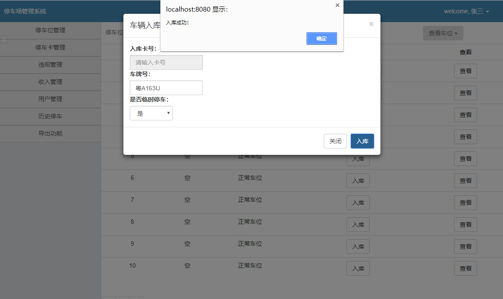
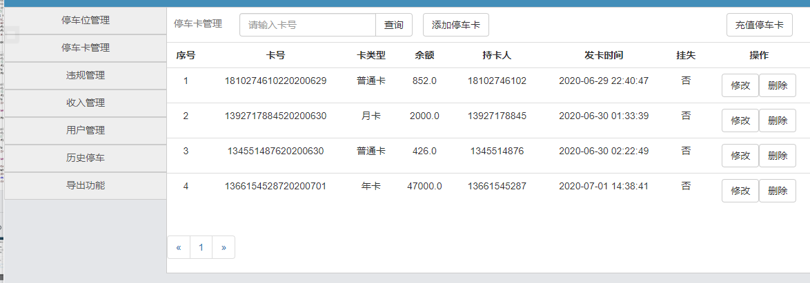
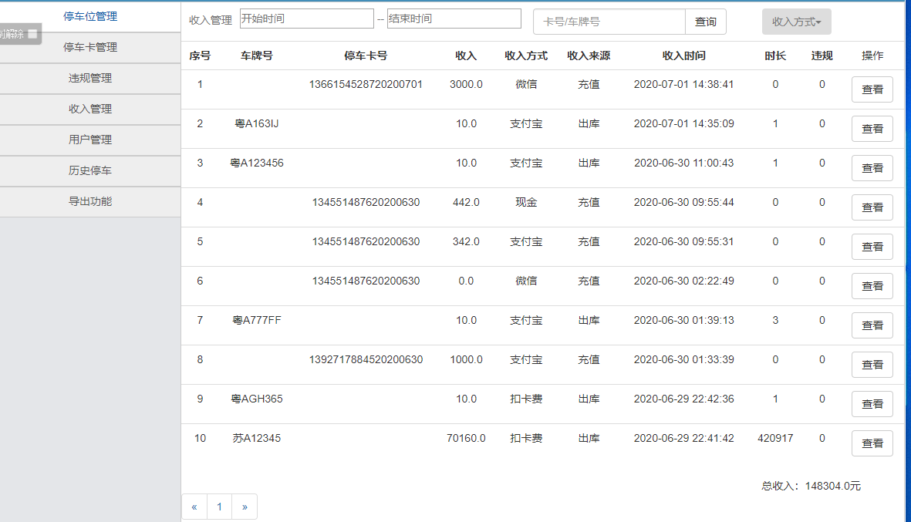

# 停车场管理系统

### 一.项目简介

主要有5个功能模块：
**1.停车位管理**
**2.停车卡管理**
**3.违规管理**
**4.收入管理**
**5.用户管理**

主要使用技术：
**Jsp+Mysql+Spring+Mybatis+Bootstrap**

开发工具：
**Eclipse**

### 二.模块介绍

#### 1.停车位管理

主要负责管理停车场的车位情况，负责车位的划分、分配等

#### 2.停车卡管理

主要负责系统管理用户的停车卡，更新用户的停车卡信息等

#### 3.违规管理

主要负责记录用户的一些违规操作，并作出对应处理

#### 4.收入管理

主要负责收取停车费用并将收费记录存入系统，可根据不同的方式进行收费

#### 5.用户管理

主要负责管理所有的系统用户，增删改查他们的信息，对人员的变动做出反应

### 三.展示

### 四.运行

导入数据库**ssm_depot_system.sql**，在**jdbc.properties**文件修改链接数据库的信息

**bulid**

